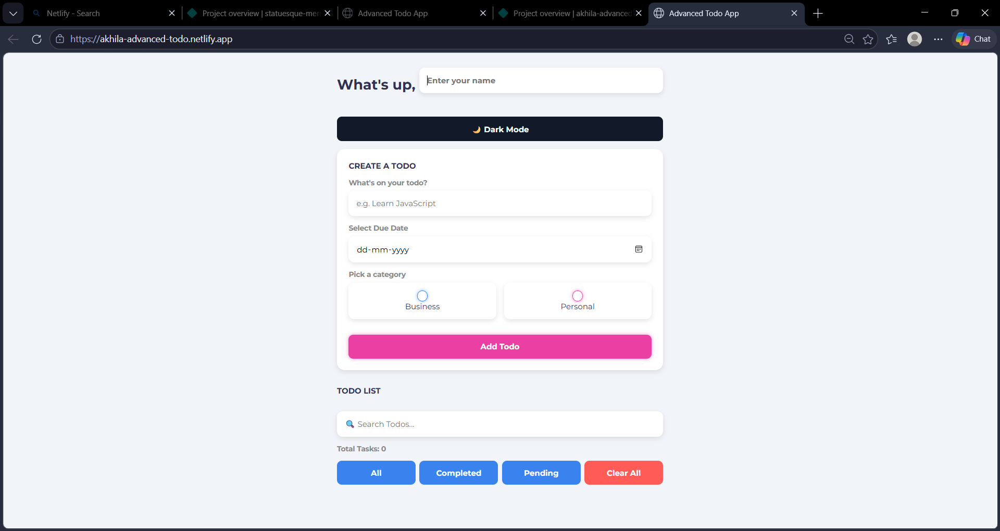

# Advanced Todo App 🚀

A modern and responsive Todo List Application built using HTML, CSS, and JavaScript.

## 🌍 Live Demo

https://akhila-advanced-todo.netlify.app

## ✨ Features

- ✅ Add Tasks
- ✏️ Edit Tasks
- 🗑️ Delete Tasks
- ✔️ Mark Tasks as Completed
- 🌙 Dark Mode
- 🔍 Search Todos
- 📅 Due Date Feature
- 📊 Task Counter
- 🎯 Filter Tasks
- 💾 LocalStorage Support
- 📱 Responsive Design

---

## 🛠️ Technologies Used

- HTML5
- CSS3
- JavaScript
- LocalStorage API

---

## 📸 Screenshot

---

## 🚀 How to Run

1. Download project
2. Open in VS Code
3. Run `index.html`

---

## 👨‍💻 Author

Akhila